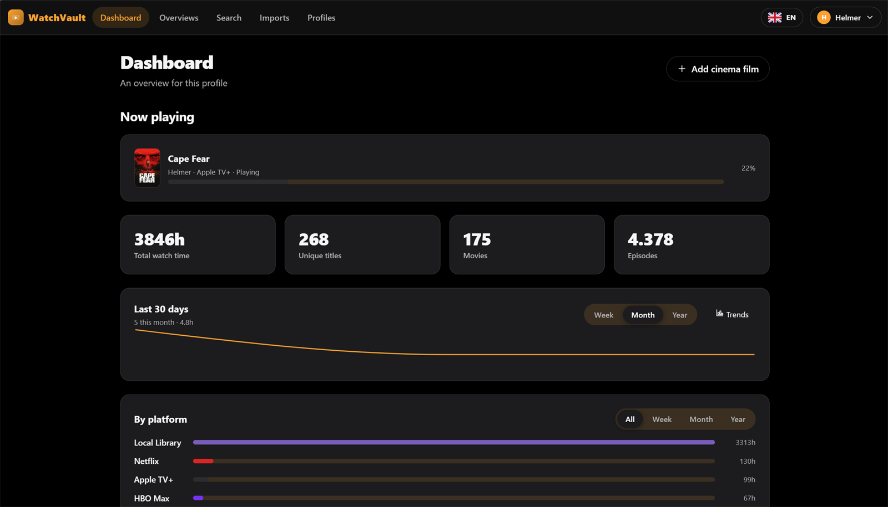
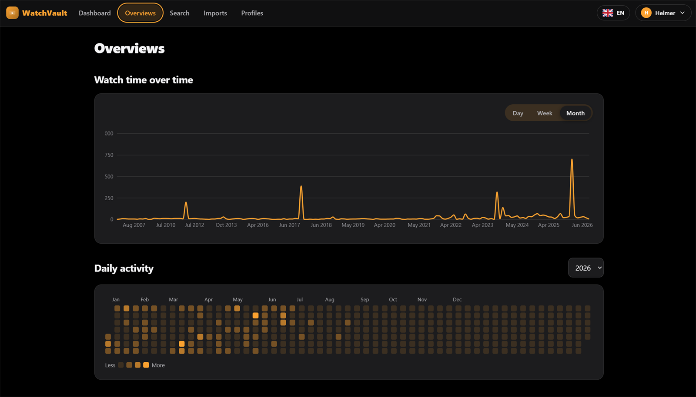
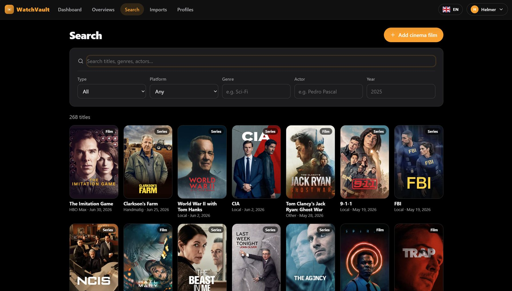
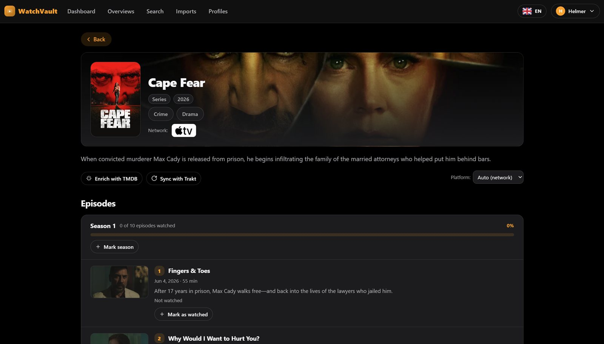
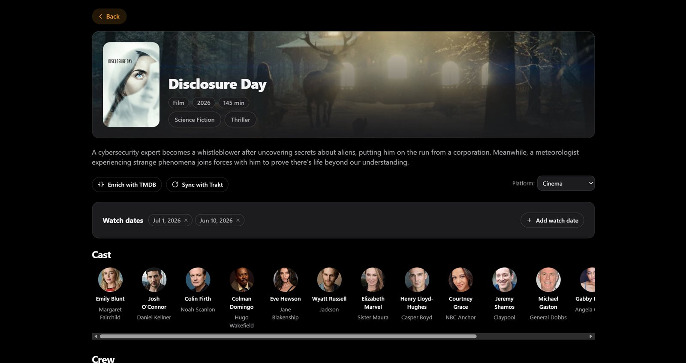
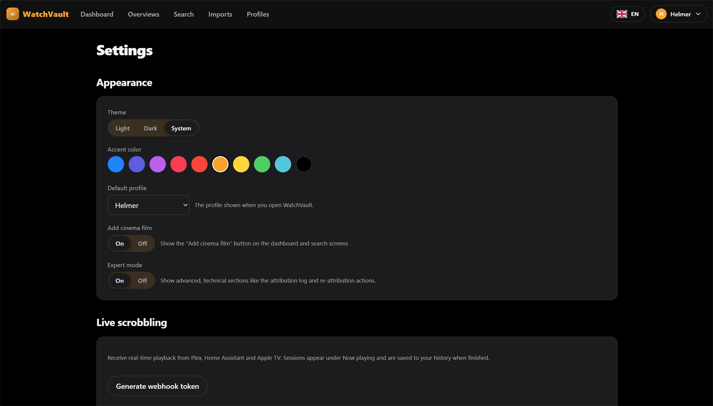
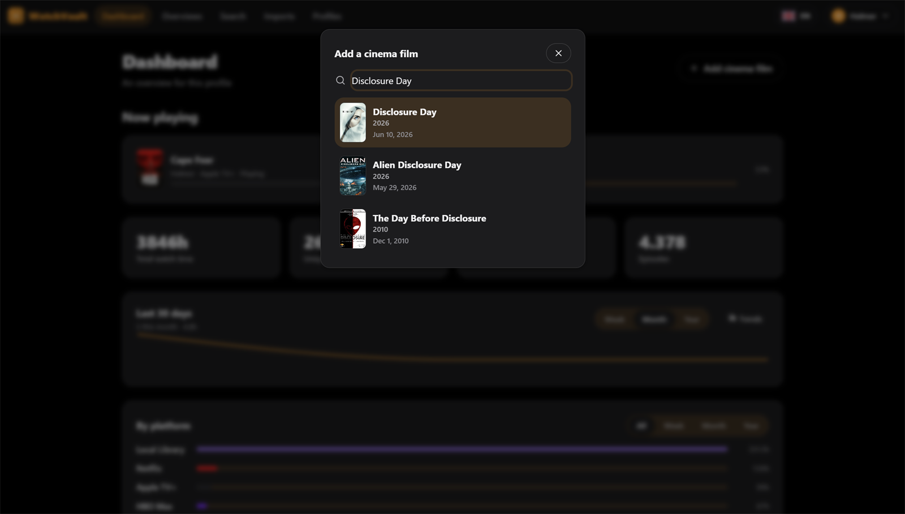
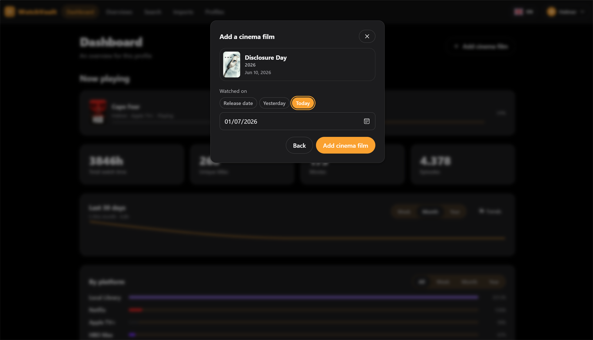

# WatchVault

**Your household's watch history, in one place.**

WatchVault is a self-hosted, multi-profile web app (PWA) that collects, normalizes,
searches and visualizes the viewing history of every streaming and media service in a
household — Netflix, Plex, Jellyfin, HBO Max, SkyShowtime, Videoland and more.
Each family member has their own passwordless profile; history is tracked per profile
and can be viewed combined at the household level.

Because most streaming services have **no public history API**, WatchVault is built
around a pluggable ingestion layer: file importers (Netflix, generic CSV/JSON), official
API syncs (Plex, Jellyfin, Trakt) and **live scrobbling** (Plex / Home Assistant / AppleTV)
all normalize into one central model. The result is a single, private, beautiful dashboard
for *everything* the household watches — across every app and device.

> **TL;DR** — `cp .env.example .env`, edit a few secrets, `docker compose up -d`,
> open `http://<host>:7210`, register (first user becomes admin). See
> [Quick start (Docker)](#quick-start-docker).

Under the hood: passwordless passkeys, a plugin runtime, an offline-sync spine, an MCP
server, and a single-container deployment (nginx + Gunicorn + worker + Postgres).

---

## Screenshots

### Desktop

<table>
  <tr>
    <td width="33%" valign="top">
      <a href="docs/screenshots/desktop/01-dashboard.png"></a>
      <br><sub><b>Dashboard</b> — Now playing, totals, trends &amp; per-platform split.</sub>
    </td>
    <td width="33%" valign="top">
      <a href="docs/screenshots/desktop/03-overviews.png"></a>
      <br><sub><b>Overviews</b> — monthly viewing, calendar heatmap, hours &amp; per-actor/genre.</sub>
    </td>
    <td width="33%" valign="top">
      <a href="docs/screenshots/desktop/04-search.jpg"></a>
      <br><sub><b>Search</b> — filter by title, genre, actor, platform or year.</sub>
    </td>
  </tr>
  <tr>
    <td width="33%" valign="top">
      <a href="docs/screenshots/desktop/02-title-detail.jpg"></a>
      <br><sub><b>Title detail</b> — seasons, episodes &amp; watch tracking.</sub>
    </td>
    <td width="33%" valign="top">
      <a href="docs/screenshots/desktop/08-film-detail.jpg"></a>
      <br><sub><b>Film detail</b> — cast &amp; crew, watch dates, TMDB/Trakt sync.</sub>
    </td>
    <td width="33%" valign="top">
      <a href="docs/screenshots/desktop/05-settings.png"></a>
      <br><sub><b>Settings</b> — appearance, household, plugins &amp; Expert Mode.</sub>
    </td>
  </tr>
  <tr>
    <td width="33%" valign="top">
      <a href="docs/screenshots/desktop/06-add-cinema.png"></a>
      <br><sub><b>Add a cinema visit</b> — search the film…</sub>
    </td>
    <td width="33%" valign="top">
      <a href="docs/screenshots/desktop/07-cinema-date.png"></a>
      <br><sub><b>…and pick the date</b> you watched it.</sub>
    </td>
    <td width="33%"></td>
  </tr>
</table>

<sub>Click any thumbnail to view it full-size. Mobile screenshots coming soon.</sub>

---

## Highlights

- **Passwordless** — WebAuthn passkeys per household member; one-time recovery codes; an
  OAuth2 + PKCE bridge so a future native iOS app can sign in with the same passkeys.
- **Provider-adapter ingestion** — every service is a self-contained *source adapter*
  implementing one interface (`import_file()` / `fetch_history()`). Adding a provider does
  not touch the core. Ships with:
  - **Netflix** — official "Viewing activity → Download all" CSV importer.
  - **Plex / Jellyfin / Trakt** — direct API sync (watch history), on-demand.
  - **Generic CSV/JSON** — for HBO Max, SkyShowtime, Videoland, Disney+, Prime…
- **Live scrobbling / Now Playing** — push real-time playback into WatchVault so streaming
  apps that have no history export still get tracked. A native **Plex webhook** and a
  generic JSON endpoint (for **Home Assistant**, **AppleTV** shortcuts, etc.) feed a
  **Now Playing** card on the dashboard and auto-commit a watch event once you've watched
  enough. Incoming account names are mapped to household profiles. (Expert Mode.)
- **Central, normalized model** — titles (with seasons/episodes), genres, cast/crew,
  watch events, providers. Titles carry an optional `external_ids` field so a title can
  later be cross-linked to other VaultStack systems (DiscVault/MovieVault) — no hard
  dependency, just a clean hook.
- **Deduplication** — repeated imports/syncs never create duplicate events.
- **TMDB enrichment (plugin)** — posters, genres, cast and year. Configurable API key;
  the app runs fine without one. Only public title names are sent to TMDB — **never** any
  watch data.
- **Source-native metadata** — each title/person keeps metadata from the source it came
  from (Netflix from Netflix, Plex from Plex, etc.); TMDB only fills the gaps. Missing
  metadata is fetched **lazily** — when a title is opened or scrolled into view.
- **Multilingual content & UI** — pick from **English, Nederlands, Français, Español,
  Italiano, Deutsch** via the flag language picker. UI strings and title/person
  biographies are stored and shown per language (with English fallback).
- **Clickable cast & crew** — every person opens a profile page with a short biography
  (in your language) and every title from any source they appear in.
- **Fast overviews at any scale** — a precomputed `watch_daily_agg` rollup keeps trends,
  heatmaps and per-platform charts fast across years of history.
- **Modern, responsive UI** — poster grids, charts (line/stacked-bar/horizontal-bar),
  a calendar heatmap, glass materials, Light/Dark/System themes and a personalizable
  accent color. Works on desktop and mobile (installable PWA, offline-capable shell).
- **Expert Mode** — an opt-in toggle (Settings → Appearance) that reveals advanced,
  technical features: live scrobbling, the import/attribution log and re-attribution
  tools, and long-press to delete a title from the database. Off by default keeps the
  everyday UI clean.
- **Little touches** — add a one-off **cinema visit** straight from the dashboard/search,
  pick a **default profile** that loads on open, a flag-based language picker, and a
  native-feeling PWA (no pinch-zoom, no long-press text callouts).

## The mandatory overviews

All scoped per profile **or** combined for the whole household:

| Overview | Where |
|---|---|
| Titles watched in a chosen month, grouped per title | Dashboard + Overviews → *Watched per month* |
| Items watched per day (calendar heatmap) | Overviews → *Daily activity* |
| Watch time per day/week/month (switchable granularity) | Overviews → *Watch time over time* |
| Items per platform per month/year (stacked) | Overviews → *Per platform* |
| Time per genre & time per actor | Overviews → *Time per genre / per actor* |
| Full search (name, genre, actor, platform, year; combinable) | Search |

---

## Architecture

```
                         ┌──────────────── single container ────────────────┐
Browser / PWA  ──:7210── │ nginx ──/api/──► Gunicorn (Flask)  :7200          │
        │                │   │     ──/mcp──► MCP server        :7211          │── Postgres 17
        │                │   └── static PWA (React/Vite)                      │     (pgcrypto)
   installable           │            worker (background sync/enrich)         │
                         └───────────────────────────────────────────────────┘
```

- **Backend:** Python 3.12, Flask + Gunicorn, psycopg3 (pooled). Forward-only,
  checksum-guarded SQL migrations run on boot.
- **Frontend:** Vite + React + TypeScript PWA (service worker, manifest, offline shell).
- **Sync spine:** a global revision sequence + tombstones power `/api/sync/changes?since=N`
  for an offline-first native client.

### Repository layout

```
backend/        Flask app, migrations, adapters, plugin runtime, MCP server, tests
  app/
    api/        stats, search, ingest, profiles, plugins, sync, meta blueprints
    auth/       passkeys, sessions, PKCE bridge
    ingest/     NormalizedEvent model, normalize/dedup, adapters/ (provider pattern)
    plugins/    plugin runtime + TMDB enrichment
  migrations/   0001..0005 SQL (identity, rbac, domain, plugins/jobs, aggregates)
  tests/        adapter parsing tests (no DB required)
frontend/       React PWA (pages: Dashboard, Overviews, Search, Imports, Profiles, Settings)
plugins/tmdb/   TMDB metadata provider plugin (manifest + plugin.py)
deploy/         nginx.conf, supervisord.conf, entrypoint.sh
sample-data/    example Netflix CSV + generic CSV/JSON exports
```

---

## Quick start (Docker)

WatchVault ships as a **single application image** (nginx + Gunicorn + worker + MCP in one
container) plus a **Postgres** container. The default `docker-compose.yml` pulls the
prebuilt image from GHCR, so you don't need a source checkout on the host.

### Prerequisites

- **Docker Engine 24+** with the **Compose v2** plugin (`docker compose …`).
- A host to run it on — Unraid, Synology, a NAS, a Raspberry Pi or any Linux box.
- ~1 GB free disk to start (grows with history + cached posters).
- For real passkeys outside `localhost`: a hostname and HTTPS (see
  [Passkeys & hostnames](#passkeys--hostnames)).

### 1. Get the files

You only need three files next to each other: `docker-compose.yml`, `.env`, and — if you
want to build from source — `docker-compose.build.yml`. Either clone the repo or just grab
`docker-compose.yml` and `.env.example`:

```bash
git clone https://github.com/helmerzNL/WatchVault.git
cd WatchVault
cp .env.example .env
```

### 2. Configure `.env`

Open `.env` and set at least the secrets. The most important variables:

| Variable | What it does | Set it to |
|---|---|---|
| `SESSION_SECRET` | Signs login sessions | A long random string (e.g. `openssl rand -hex 32`) |
| `POSTGRES_PASSWORD` | Database password | A strong password |
| `RP_ID` | WebAuthn relying-party ID | Your hostname (`localhost` for local testing) |
| `RP_ORIGINS` | Allowed passkey origin(s) | Full origin, e.g. `https://watchvault.example.com` |
| `WEB_PORT` | Public port published on the host | `7210` (change if taken) |
| `DATA_PATH` | Host folder for persistent data | `./data` or an absolute path |
| `REGISTRATION_INVITE_CODE` | Optional gate for sign-ups | Leave empty to allow open registration |
| `TMDB_API_KEY` | Optional poster/genre/cast enrichment | A free TMDB key (or set it later in the UI) |

Everything else has sane defaults. The internal ports (`API_PORT`, `MCP_PORT`) never need
to be exposed.

### 3. Start it

```bash
docker compose up -d
```

Open **http://&lt;host&gt;:7210**. The **first** person to register creates the household and
becomes the admin — **save the recovery codes** shown on sign-up (they're the only way back
in if you lose every passkey). Add the other family members from **Settings → Household**.

Optionally set `TMDB_API_KEY` now or later in **Settings → Plugins** to enrich titles with
posters, genres and cast.

### Build from source instead

If you have the repo checked out and want to build the image locally instead of pulling
from GHCR:

```bash
docker compose -f docker-compose.yml -f docker-compose.build.yml up -d --build
```

### Updating

```bash
docker compose pull        # fetch the latest published image
docker compose up -d       # recreate the app container
```

Database **migrations apply automatically on boot** — there's no manual migration step.
Your data lives in `DATA_PATH` on the host, so pulling a new image never touches it.

### Data & backups

Everything persistent is stored under `DATA_PATH` (default `./data`):

```
data/
  app/         uploaded import files & app data
  postgres/    the PostgreSQL data directory (titles, history, metadata)
```

To back up, stop the stack (or use a DB dump) and copy the folder:

```bash
docker compose down
tar czf watchvault-backup-$(date +%F).tar.gz data/
docker compose up -d
```

For a hot, consistent database backup without downtime you can instead
`docker compose exec db pg_dump -U "$POSTGRES_USER" "$POSTGRES_DB" > watchvault.sql`.

### Reverse proxy & HTTPS

Passkeys require a **secure context**, so anything other than `localhost` must be served
over **HTTPS**. Put WatchVault behind your reverse proxy (Nginx Proxy Manager, Traefik,
Caddy, …), forward the public hostname to the container's `WEB_PORT` (`7210`), and set:

```
RP_ID=watchvault.example.com
RP_ORIGINS=https://watchvault.example.com
```

Only the one public port is published; `/api` and `/mcp` are served on that same origin.

### Ports

| Port | Purpose |
|---|---|
| `7210` | Public entry point (nginx) — PWA, `/api` **and** `/mcp` |
| `7200` | Internal API (Gunicorn) — not exposed publicly |
| `7211` | Internal MCP server — proxied at `/mcp`, not exposed publicly |

Only **one** port is published. The MCP server is reachable on the main URL at
`http://<host>:7210/mcp`.

### Passkeys & hostnames

WebAuthn is bound to the origin. For anything other than `localhost`, set:

```
RP_ID=watchvault.example.com
RP_ORIGINS=https://watchvault.example.com
```

Passkeys require a secure context — use `localhost` for local testing or HTTPS
(e.g. behind a reverse proxy) in production.

---

## Importing history

**Netflix** — Account → *Profile* → **Viewing activity** → **Download all**. In WatchVault:
**Imports → Import a file**, pick *Netflix*, choose the profile, upload the CSV.

**Plex / Jellyfin** — **Imports → API sync connections → Add**, enter the server URL and an
API token (`X-Plex-Token` / Jellyfin API key). Optionally click **Load libraries** and tick
which libraries to include (leave empty to sync all), then **Sync** on demand. You can change
the selection later with **Edit libraries** on the connection — items from libraries you
deselect are removed from the watch list, and re-selecting one re-imports it on the next sync.
For Plex you can also restrict history to a single account by **username or numeric ID**.
Use **Clear items** on any connection to wipe everything it imported without removing the
connection (the cursor is kept, so only genuinely new watches are pulled afterwards).

**Trakt** — create an app at [trakt.tv/oauth/applications](https://trakt.tv/oauth/applications)
and copy its **Client ID** and **Client Secret**. In **Imports → API sync connections → Add**,
pick *Trakt*, enter the Client ID, Client Secret and your username. Trakt profiles are
**private by default**, so click **Open Trakt authorization**, approve the app, and paste the
**PIN** back, then **Authorize** — WatchVault exchanges it for an access + refresh token (set
username to `me`). Your own history — including private — is then read via `/sync/history`, and
the access token is refreshed automatically before it expires. A public profile works with just
the Client ID. Then **Sync** on demand.

**Other services** — export your data (manual CSV or a GDPR/data request) and import it via
the *Generic CSV/JSON* provider. The generic adapter auto-detects common column names
(`title`, `date`, `season`, `episode`, `duration`/`minutes`, `progress`, …).

Sample files to try live in [`sample-data/`](sample-data/).

### Live scrobbling (Now Playing)

For services with no history export, push **real-time playback** into WatchVault. Enable
**Expert Mode** (Settings → Appearance), then open the **Live scrobbling** section in
Settings. Generate a webhook token there — it shows ready-to-copy **Plex** and **generic**
URLs — and map incoming account names to household profiles. Playback shows up on the
dashboard's **Now playing** card and is saved as a watch event once it passes the
completion threshold.

- **Plex** — paste the **Plex webhook URL** into Plex (Plex Pass → Settings → Webhooks):
  `http://<host>:7210/api/scrobble/plex?token=wvapi_…`. Plex can't send an `Authorization`
  header, so the token is carried in the `?token=` query parameter.
- **Home Assistant / Apple TV / Shortcuts** — POST a small JSON payload (title, type,
  progress, account) to the **generic endpoint**
  `http://<host>:7210/api/scrobble/generic` with the shown `Authorization: Bearer wvapi_…`
  header. Handy from a Home Assistant automation on a `media_player` state change, or an
  Apple Shortcut.

Because it's gated behind Expert Mode, the whole scrobbling UI stays hidden for everyday
household members.

### Starting over

To wipe everything and begin from an empty database, go to **Settings → Danger zone →
Reset all data**, type the confirmation word and confirm. This permanently deletes all
imported films/series, the entire watch history and the full metadata catalogue (titles,
episodes, cast & crew, genres). Your configured connections are kept, and their sync
cursors are reset so the next sync re-imports everything from scratch. The action is
admin-only (`settings.manage`) and cannot be undone.

---

## Adding a new provider

1. Create `backend/app/ingest/adapters/<name>.py` with a class extending `SourceAdapter`
   and implementing `import_file()` (file-based) and/or `fetch_history()` (API-based),
   returning `NormalizedEvent`s.
2. Register it in `backend/app/ingest/adapters/__init__.py`.
3. Add a row to the `providers` seed (migration `0003_domain.sql`) pointing at your adapter.

No core logic, normalization, dedup, aggregation or UI code needs to change.

---

## MCP server

The MCP bridge is served on the main URL at **`/mcp`** (internally the MCP process
listens on `:7211`, reverse-proxied by nginx). It exposes `search` and `stats` tools so an
AI assistant can answer questions about your watch history. Create a personal token under
**Settings → API tokens** and authenticate with `Authorization: Bearer wvapi_…`. Tokens are
stored salted-hashed and are gated by the `mcp.use` / `mcp.tool.<name>` permissions.

---

## Development

Backend (no DB needed for the adapter tests):

```bash
python -m venv .venv && . .venv/Scripts/activate    # Windows: .\.venv\Scripts\Activate.ps1
pip install -r backend/requirements.txt
pytest backend/tests -q
```

Run the API/worker/MCP locally against a Postgres instance by setting the `POSTGRES_*`
vars from `.env`, then `python backend/wsgi.py` (or Gunicorn) — migrations apply on boot.

Frontend:

```bash
cd frontend
npm install
npm run dev     # http://localhost:7212, proxies /api and /mcp to the backend
npm run build   # outputs dist/ (served by nginx in the container)
```

---

## Privacy & non-functional notes

- **Self-hosted & private** — all watch data stays in your Postgres. The only outbound
  calls are public TMDB title lookups for metadata; no personal watch data is sent.
- **Extensible** — new services are new adapters; new metadata sources are new plugins.
- **Performant** — overviews read precomputed daily aggregates, not raw events.
- **Out of scope (for now):** recommendations and social/sharing features (comparing with
  other households, public profiles).

## License

Private household project. Not for redistribution.
